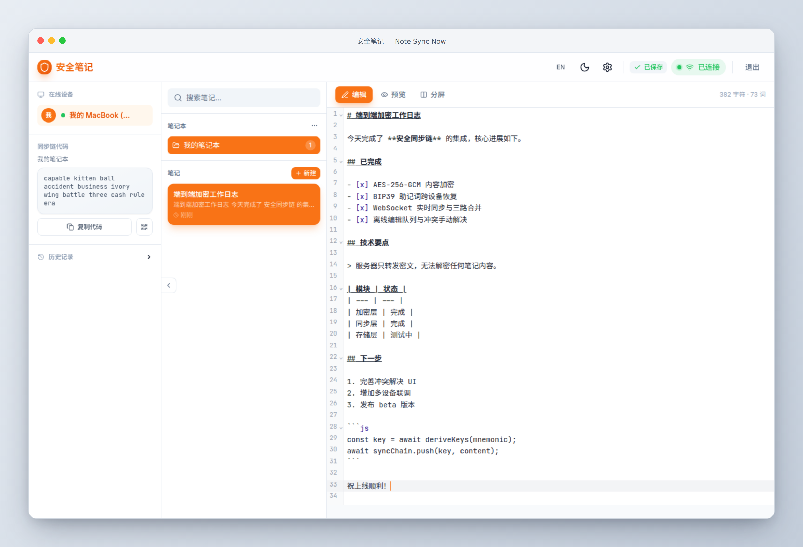
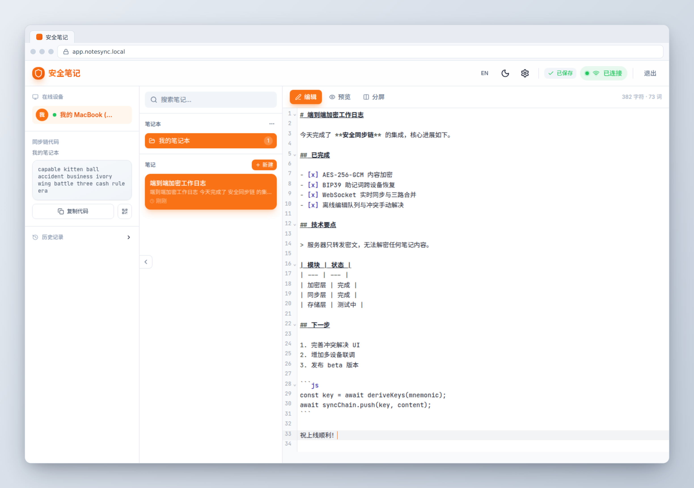

# shotkit · AI 开发者的 WSL 截图工作台

> 面向中文开发者的「截图全流程」Agent Skill 集合：**捕获 → 美化 → 输出**，一条龙。

在 WSL 里用 AI 编程工具（opencode / Claude Code / Codex）的开发者，截图一直是个老大难：

- **截不了 Windows 桌面**：Linux 的 `scrot`/`import` 只认识 X 输出，截不到 Windows 屏幕
- **剪贴板粘贴坏图**：WSLg 把图片转成特殊 BMP，AI 工具直接报「不支持的图片格式」
- **截图不好看**：README / 文档里的裸截图缺乏产品感

shotkit 把这些痛点一次性解决，提供两个配套 skill：

| Skill | 作用 | 说明 |
| --- | --- | --- |
| [`wsl-capture`](./skills/wsl-capture/) | 捕获 | 从 WSL 截 Windows 桌面 / 窗口 / 浏览器页面，多后端自动降级 |
| [`shotframe`](./skills/shotframe/) | 美化 | 给截图套 **浏览器边框** 或 **macOS 窗口框**，零依赖出图 |

完整工作流：`wsl-capture` 截到图 → `shotframe` 套框 → 直接进 README / 博客 / 商店截图。

## 特性

- **零依赖**：两个 skill 都只依赖系统已有的 Chromium，不装任何 npm 包
- **确定性输出**：真实截图 + 渲染脚本，绝不凭空捏造 UI
- **中文优先**：全中文文档、中文示例、中文错误提示
- **开箱即用**：`bash <(curl -s ...)` 一键安装到 opencode / Claude Code

## 安装

```bash
# 一键安装两个 skill 到本机（opencode + Claude Code 双支持）
bash <(curl -s https://raw.githubusercontent.com/holtwood/shotkit/main/install.sh)
```

也可以手动放置：

```bash
# opencode
ln -s "$(pwd)/skills/shotframe" ~/.config/opencode/skills/shotframe
ln -s "$(pwd)/skills/wsl-capture" ~/.config/opencode/skills/wsl-capture

# Claude Code
ln -s "$(pwd)/skills/shotframe" ~/.claude/skills/shotframe
ln -s "$(pwd)/skills/wsl-capture" ~/.claude/skills/wsl-capture
```

## 快速开始

```bash
# 1. 截一个浏览器页面（自动找 Chromium）
skills/wsl-capture/scripts/capture.sh browser https://example.com -o ~/shots/page.png

# 2. 截 Windows 当前屏幕（走 PowerShell interop）
skills/wsl-capture/scripts/capture.sh screen -o ~/shots/desktop.png

# 3. 套 macOS 窗口框
skills/shotframe/scripts/frame.js --input ~/shots/page.png --preset macos --output ~/shots/page-macos.png

# 4. 套浏览器边框
skills/shotframe/scripts/frame.js --input ~/shots/page.png --preset browser --title "我的产品" --url app.example.com --output ~/shots/page-browser.png
```

## 效果示例

| macOS 窗口框 | 浏览器边框 |
| --- | --- |
|  |  |

## 设计理念

- **捕获与渲染分离**：`wsl-capture` 负责「拿到真实像素」，`shotframe` 负责「穿衣服」，两者通过文件路径解耦，可独立使用
- **多后端降级**：每个能力都有多套后端（PowerShell interop → WSLg → X11），环境探测失败自动降级
- **确定性 > 生成式**：不调用任何图像生成模型，输出 100% 来自真实截图

## 路线图

- [x] 浏览器黑白边框框架（Browser / macOS）
- [ ] iPhone / iPad / MacBook 设备框
- [ ] 批量套框（目录输入）
- [ ] 截图 → GIF 演示动画
- [ ] 中文视频教程

## 许可

[MIT](./LICENSE)