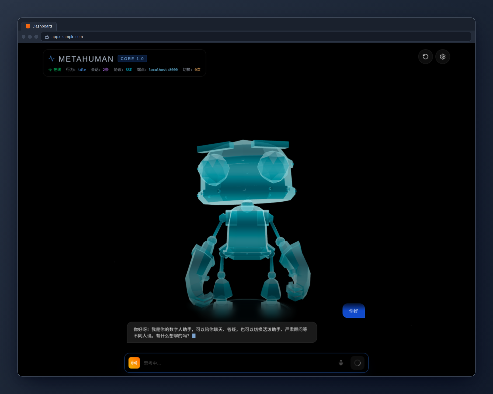
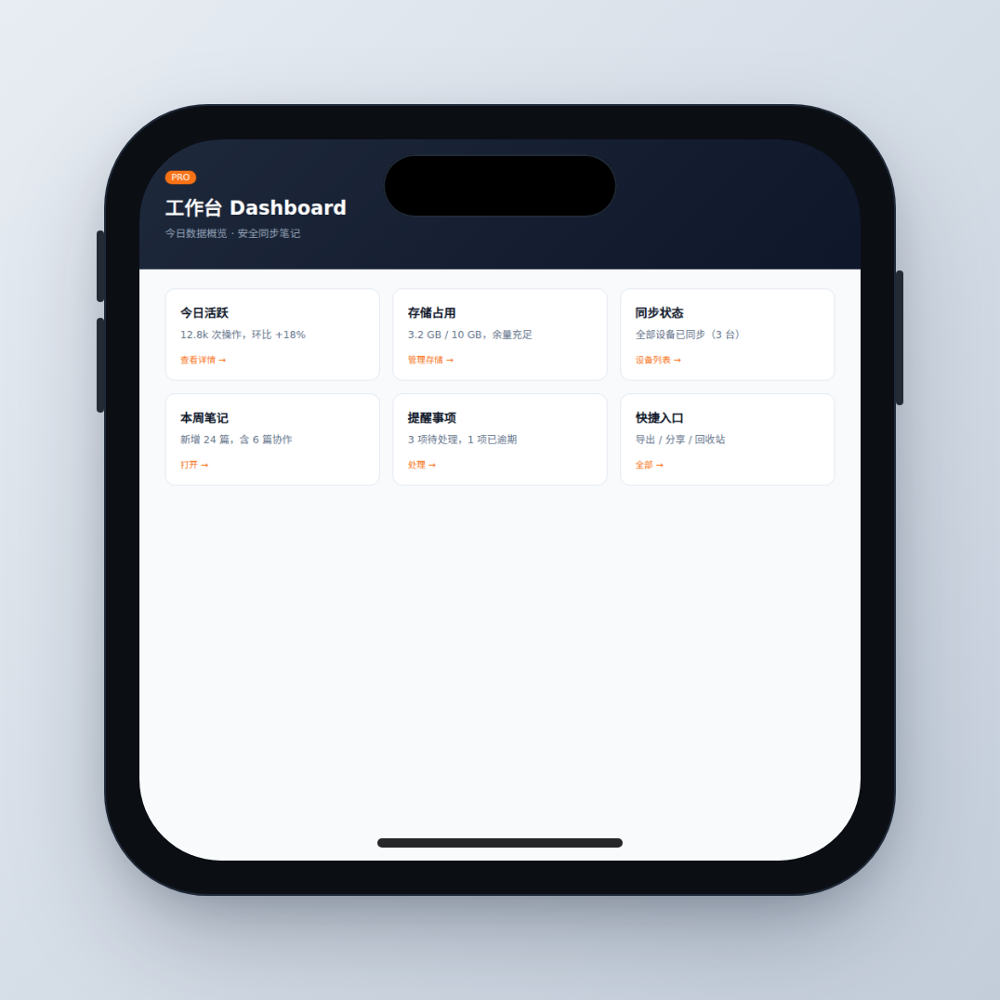
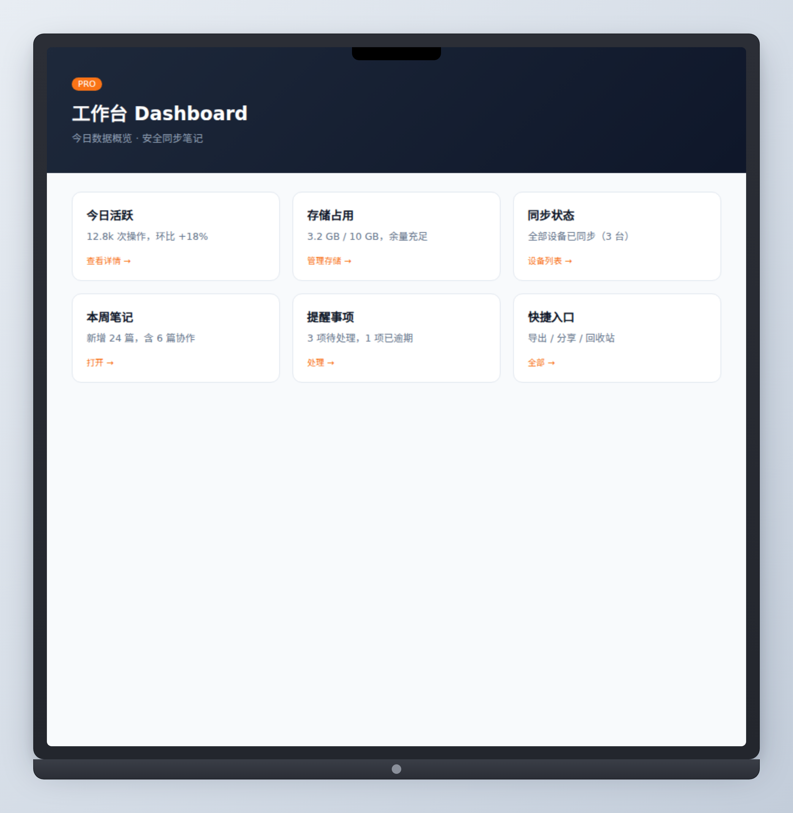

# Shotframe · 截图套框

把一张「裸截图」变成有产品感的成品图：**浏览器边框**、**macOS 窗口框** 或 **设备框（iPhone / iPad / MacBook）**。
深色 UI 自动获得深色 chrome 与深色背景，浅色 UI 自动获得浅色配色——整图对比协调，不会出现"浅色浮条贴在黑色 App 上"的违和感。

## 何时使用

- 用户想把截图放进 README / 文档 / 博客，希望好看一点
- 用户提供截图文件路径，要求「加个边框/加个框」
- 用户想要应用商店（App Store / Play）风格的展示图
- 用户说「给我截图套个手机/电脑框」——移动端截图配 iPhone / iPad 框，桌面端配 MacBook 框
- 批量给一组截图统一风格

## 何时不要用

- 用户要的是「凭空生成一个 UI」——这是图像生成模型的事，本 skill 只用真实截图
- 用户只需要裁切 / 缩放 / 改格式——直接交给图像工具，别套框
- 用户明确要设备照片级的真实边框（可以用 Photoshop 类工具）

## 硬性契约（跨 harness 调用必须遵守）

1. **渲染必须且只能通过 `scripts/frame.js`**——禁止手写 HTML/CSS、禁止用其他截图工具"仿制"套框效果。找不到 Chromium 时如实报错，不要自行替代实现。
2. **渲染后核对退出码与尺寸**：frame.js 会校验输出尺寸（期望 = 逻辑尺寸 × 2）并自动校正重试一次；仍不符时以**退出码 3** 失败——此时向上报告失败，不要拿构图可疑的产物交差。
3. **主题交给 `--theme auto`**（默认值）：深色 UI 自动得到深色 chrome。不要为适配深色模式而修改渲染器、改代码或换用手搓方案。

## 渲染器契约

```bash
node <skill目录>/scripts/frame.js \
  --input <截图路径> \
  --preset <browser|macos|device> \
  --output <输出路径.png>
```

可选参数：

| 参数 | 说明 | 默认 |
| --- | --- | --- |
| `--preset` | `browser` 浏览器边框 / `macos` macOS 窗口框 / `device` 设备框 | `browser` |
| `--device` | 设备框机型：`iphone` / `ipad` / `macbook`（仅 `--preset device` 时生效） | `iphone` |
| `--title` | 窗口标题（macOS 标题栏 / 浏览器标签页） | 不显示 |
| `--url` | 浏览器地址栏 URL | 不显示 |
| `--theme` | `auto` / `light` / `dark`——同时决定 chrome（标签页/标题栏）与外层背景的深浅配色；`auto` 按截图亮度自动选择 | `auto` |
| `--trim` | 裁掉输入四周与四角同色的**纯色空白边**（桌面背景/视口留白）后再套框；仅适用于裸截图。注意：应用自身的大片纯色空白区（如空白编辑区）也会被裁除，仅在确认四周空白是"多余画布"时使用 | 关闭 |
| `--background` | （旧参数）仅覆盖外层背景色，chrome 仍跟随 `--theme`；一般用 `--theme` 即可 | 跟随 theme |
| `--padding` | 设备/窗口四周留白（px） | `56` |
| `--chromium` | 指定 Chromium 可执行文件路径 | 自动探测 |

## 预设说明

- **`macos`**：圆角窗口 + 居中标题栏 + 红黄绿信号灯 + 柔和投影（深浅两套配色）
- **`browser`**：标签页 + 地址栏（锁图标 + URL）+ 同款投影（深浅两套配色）
- **`device`**：按机型渲染真实感设备框——`iphone` 灵动岛 + home 指示条 + 侧边按键，`ipad` 顶部摄像头 + home 指示条，`macbook` 铝制机身 + 屏幕刘海 + 底部下巴（含 Apple logo）。截图按设备屏幕宽度等比缩放填充

## 工作流

1. **确认输入是真实截图文件**（本地路径）。如果是 URL 或「正在运行的应用」，先交给 `wsl-capture` 或浏览器工具截图，拿到文件后再调用本 skill。
   - 输入应为**应用视口内容**：先裁掉桌面壁纸、原生浏览器边框等无关区域
   - 截图四周若有纯色空白边，加 `--trim` 自动裁除
2. **选 preset**：
   - Web 应用 / 仪表盘 → `browser`（除非用户点名 macOS）
   - 桌面应用 → `macos`
   - 移动端 App 截图 → `device` + `--device iphone`（或用户指名的机型）；桌面端产品图想要笔记本效果 → `device` + `--device macbook`
3. **渲染**：输出路径用描述性文件名（如 `pricing-browser.png`）。按需加 `--title` / `--url`。主题保持默认 `--theme auto`（深色 UI 自动适配，无需人工判断）。
4. **验证**：确认 frame.js 退出码为 0，输出文件存在且非空；日志中 `theme=` 与 `trim=` 字段可向用户转述。退出码非 0 时按「常见问题」排查，**不要**改用手搓方案。
5. 结果图可直接用于 README / 文档（配 `./docs/screenshots/xxx.png` 相对路径）。

## 示例

```bash
# macOS 窗口框
node scripts/frame.js --input ./tmp/desktop.png --preset macos \
  --title "安全同步笔记" --output ./docs/screenshots/app-macos.png

# 浏览器边框，深色 UI 自动适配（--theme auto 为默认）
node scripts/frame.js --input ./tmp/dark-ui.png --preset browser \
  --title "Dashboard" --url app.example.com \
  --output ./docs/screenshots/dashboard-browser.png

# 显式深色 chrome + 裁掉四周纯色留白
node scripts/frame.js --input ./tmp/app.png --preset browser --theme dark --trim \
  --title "Dashboard" --url app.example.com \
  --output ./docs/screenshots/dashboard-dark.png

# iPhone 设备框（移动端截图）
node scripts/frame.js --input ./tmp/app-ios.png --preset device --device iphone \
  --output ./docs/screenshots/app-iphone.png

# MacBook 设备框（桌面端截图）
node scripts/frame.js --input ./tmp/app-desktop.png --preset device --device macbook \
  --output ./docs/screenshots/app-macbook.png
```

## 示例效果







## 实现说明

- **零 npm 依赖**：渲染 = Node 标准库生成 HTML + 系统 Chromium 无头截图（`--force-device-scale-factor=2` 保证清晰度）
- **主题自适应**：内置零依赖 PNG 解码器（仅 8-bit 非隔行），`--theme auto` 按**裁剪后区域**的全图采样亮度自动选择深/浅整套配色（chrome + 背景 + 描边 + 投影）；解码失败回退 light 并提示
- **`--trim`**：同一解码器检测四角同色的均匀空白边（容差收紧防误裁渐变，每边最多裁 20%），像素级裁剪后重封装 PNG 再进渲染流程
- **尺寸校验**：输出应为逻辑尺寸 × 2；不符时按差值校正窗口尺寸自动重试一次，仍不符以退出码 3 失败（防御无头窗口被显示环境钳制）
- 设备框为纯 CSS 绘制（机身 / 灵动岛 / 刘海 / 按键 / logo 均为样式实现），截图按设备屏幕宽度等比缩放填充，不拉伸变形
- Chromium 自动探测顺序：`SHOTFRAME_CHROMIUM` 环境变量 → Playwright 缓存目录 → `which chromium / google-chrome / chrome`
- 输入格式：PNG（自动读取宽高，无需额外库）
- 输出 2 倍尺寸（等价 Retina），README 里按需 `width=` 限制显示

## 常见问题

- **找不到 Chromium**：`sudo apt install chromium` 或安装 playwright 后重试；也可显式 `--chromium /path/to/chrome`
- **输出全是空白**：检查输入 PNG 是否损坏；`file input.png` 确认格式
- **退出码 3（输出尺寸不符）**：无头窗口被显示环境钳制（屏幕/虚拟显示过小）——换更大的虚拟屏（如 Xvfb 调大分辨率）或减小输入截图宽度后重试
- **主题误判**（如浅色 UI 内嵌大片深色图片、截图带大面积空白边）：auto 按画面亮度判断，极端构图可能选错主题——显式加 `--theme light` 或 `--theme dark` 覆盖
- **`--trim` 裁多了/裁少了**：该参数只面向「四周为纯色空白边」的裸截图；应用自身的纯色空白区（空白编辑器/纯色画布）也会被视为边而裁除，渐变背景则会因超容差而停止——不确定时不用它
- **想更清晰**：输出已是 2x，README 中建议 `` 展示
