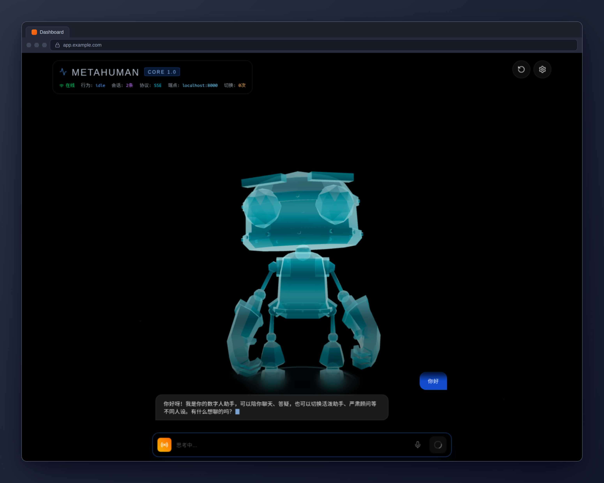
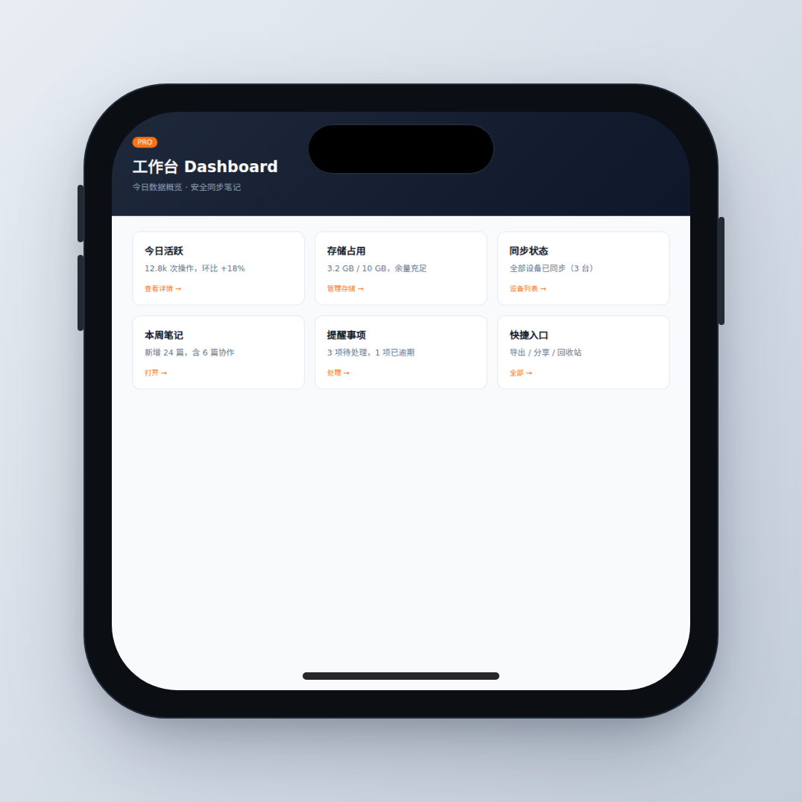
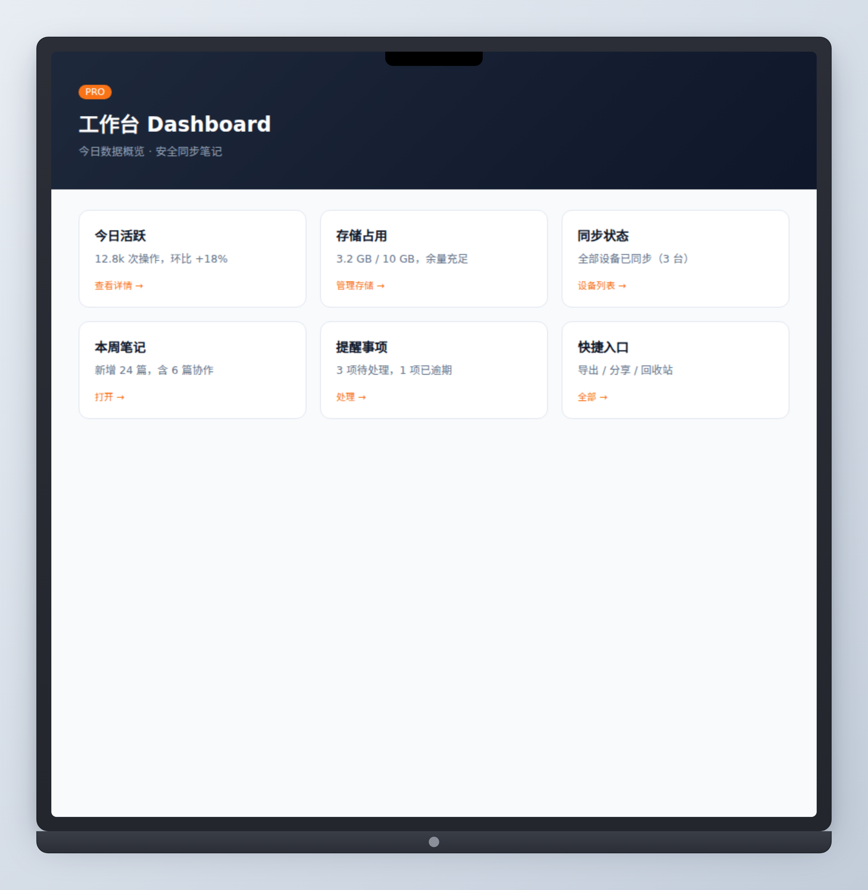

# Shotframe · 截图套框

把一张「裸截图」变成有产品感的成品图：**浏览器边框**、**macOS 窗口框** 或 **设备框（iPhone / iPad / MacBook）**。
深色 UI 自动获得深色 chrome 与深色背景，浅色 UI 自动获得浅色配色——整图对比协调，不会出现"浅色浮条贴在黑色 App 上"的违和感。

## 何时使用

- 用户想把截图放进 README / 文档 / 博客，希望好看一点
- 用户提供截图文件路径，要求「加个边框/加个框」
- 用户想要应用商店（App Store / Play）风格的展示图
- 用户说「给我截图套个手机/电脑框」——移动端截图配 iPhone / iPad 框，桌面端配 MacBook 框
- 批量给一组截图统一风格

## 何时不要用

- 用户要的是「凭空生成一个 UI」——这是图像生成模型的事，本 skill 只用真实截图
- 用户只需要裁切 / 缩放 / 改格式——直接交给图像工具，别套框
- 用户明确要设备照片级的真实边框（可以用 Photoshop 类工具）

## 硬性契约（跨 harness 调用必须遵守）

1. **渲染必须且只能通过 `scripts/frame.js`**——禁止手写 HTML/CSS、禁止用其他截图工具"仿制"套框效果。找不到 Chromium 时如实报错，不要自行替代实现。
2. **渲染后核对退出码与尺寸**：frame.js 会校验输出尺寸（期望 = 逻辑尺寸 × 设备像素比）并自动校正重试一次；仍不符时以**退出码 3** 失败。另有**退出码 1 + `output/missing`** 表示 Chromium 退出但根本没写出文件（浏览器不可用）——两种情况都向上报告失败，不要拿构图可疑或根本不存在的产物交差。
3. **主题交给 `--theme auto`**（默认值）：深色 UI 自动得到深色 chrome。不要为适配深色模式而修改渲染器、改代码或换用手搓方案。

## 渲染器契约

```bash
node <skill目录>/scripts/frame.js \
  --input <截图路径> \
  --preset <browser|macos|device> \
  --output <输出路径.png>
```

可选参数：

| 参数 | 说明 | 默认 |
| --- | --- | --- |
| `--preset` | `browser` 浏览器边框 / `macos` macOS 窗口框 / `device` 设备框 | `browser` |
| `--device` | 设备框机型：`iphone` / `ipad` / `macbook`（仅 `--preset device` 时生效） | `iphone` |
| `--title` | 窗口标题（macOS 标题栏 / 浏览器标签页） | 不显示 |
| `--url` | 浏览器地址栏 URL | 不显示 |
| `--theme` | `auto` / `light` / `dark`——同时决定 chrome（标签页/标题栏）与外层背景的深浅配色；`auto` 按截图亮度自动选择 | `auto` |
| `--trim` | 裁掉输入四周与四角同色的**纯色空白边**（桌面背景/视口留白）后再套框；仅适用于裸截图。注意：应用自身的大片纯色空白区（如空白编辑区）也会被裁除，仅在确认四周空白是"多余画布"时使用 | 关闭 |
| `--bg` | 背景：命名渐变预设（`aurora`/`sky`/`sunset`/`ocean`/`lavender`/`forest`/`candy`/`slate`/`mono`，随 `--theme` 取深浅变体）、`solid:#0f172a`、`linear:#a8edea,#fed6e3`、`none`（透明） | 跟随 theme |
| `--angle` | 渐变角度（度）；对所有渐变背景生效，**包括内置主题背景** | `135` |
| `--ratio` | 画布比例：命名（`og`/`linkedin`/`twitter`/`x`/`instagram`/`instagram-portrait`/`story` 等）或任意 `W:H` / `WxH`。**只扩画布不裁剪**，多出来的空间由背景填充 | 按内容 |
| `--width` | 目标输出宽度（px）。**只缩小不放大**；成功时宽度精确等于该值，无法做到时**明确失败**（`config/width-too-small`）或用 `warnings` 说明，绝不静默给别的尺寸。实现方式是按目标宽度直接渲染（调整设备像素比），而不是先出 2x 再整图缩小 | 内容的 2 倍 |
| `--inset` | 采样截图边缘最常见的颜色，在卡片内侧衬一圈同色衬边（px） | 关闭 |
| `--radius` | 卡片圆角（px，窗口/设备框） | 预设值 |
| `--transparent` | 输出透明背景 PNG（带 alpha，便于叠到任意底图上） | 关闭 |
| `--all` | 对每个背景预设各出一张；`--output` 作为基名（`out.png` → `out-aurora.png`…）。**一旦给了 `--all`，同时给的 `--bg` 会被忽略**（9 张已覆盖全部预设） | 关闭 |
| `--list` | 列出所有可用 preset / device / theme / ratio / background 后退出（**不确定取值先跑这个**） | 关闭 |
| `--json` | 在 stdout 输出机读回执。成功与失败**顶层字段成套**：`ok` / `command` / `exitCode`（成功为 `0`）——可统一写 `if (!j.ok)` 判断，不会把成功误判成失败。成功另有 `canvas` / `outputs` / `warnings`，失败有 `error.code` + `error.supportedFixes`；人类日志走 stderr | 关闭 |
| `--background` | （旧参数）等价于 `--bg light` / `--bg dark`，一般直接用 `--bg` | 跟随 theme |
| `--padding` | 设备/窗口四周留白（px） | `56` |
| `--chromium` | 指定 Chromium 可执行文件路径 | 自动探测 |

## 预设说明

- **`macos`**：圆角窗口 + 居中标题栏 + 红黄绿信号灯 + 柔和投影（深浅两套配色）
- **`browser`**：标签页 + 地址栏（锁图标 + URL）+ 同款投影（深浅两套配色）
- **`device`**：按机型渲染真实感设备框——`iphone` 灵动岛 + home 指示条 + 侧边按键，`ipad` 顶部摄像头 + home 指示条，`macbook` 铝制机身 + 屏幕刘海 + 底部下巴（含 Apple logo）。截图按设备屏幕宽度等比缩放填充

## 背景与画布

- **背景**：默认跟随 `--theme`（深浅两套内置背景）。想更出彩用 `--bg <预设>`（9 组渐变预设，各有深浅变体，会跟随 `--theme auto` 自动选）；要精确控制用 `--bg solid:#0f172a` 或 `--bg linear:#a8edea,#fed6e3`（可配 `--angle`）。
- **社媒画布**：`--ratio og` / `--ratio twitter` / `--ratio instagram` / `--ratio instagram-portrait` / `--ratio story`，或任意 `--ratio 16:9`。规则是**只扩画布不裁剪**——内容始终居中且完整保留，多出来的空间由背景填充；再配 `--width 1200` 落到平台推荐尺寸（`--width` 只缩小不放大）。
- **边缘色衬边**：`--inset 12` 采样截图四周最常见的颜色，在卡片内侧衬一圈同色边，让「截图自带留白」和「卡片」自然衔接。区域截图通常已有自身边距，可以不开。
- **透明底**：`--transparent`（等价 `--bg none`）输出带 alpha 的 PNG，方便叠到 PPT / 任意底图上。
- **挑风格**：`--all` 一次出全部 9 个背景预设（`--output out.png` → `out-aurora.png` …），从里面挑一张再精修。

## 工作流

1. **确认输入是真实截图文件**（本地路径）。如果是 URL 或「正在运行的应用」，先交给 `wsl-capture` 或浏览器工具截图，拿到文件后再调用本 skill。
   - 输入应为**应用视口内容**：先裁掉桌面壁纸、原生浏览器边框等无关区域
   - 截图四周若有纯色空白边，加 `--trim` 自动裁除
2. **选 preset**：
   - Web 应用 / 仪表盘 → `browser`（除非用户点名 macOS）
   - 桌面应用 → `macos`
   - 移动端 App 截图 → `device` + `--device iphone`（或用户指名的机型）；桌面端产品图想要笔记本效果 → `device` + `--device macbook`
3. **选背景与画布**（可选，但决定「是否好看」）：
   - 用户点名风格 → `--bg sunset` / `--bg solid:#0f172a`；拿不准就 `--all` 一次出 9 张让他挑
   - 目标是社媒 / OG / 商店 → 加 `--ratio og`（或对应平台）+ `--width` 落到推荐尺寸
   - 想让卡片与截图边界更自然 → `--inset 12`
   - 取值不确定时先跑 `--list`（或 `--list --json`）拿全部合法取值，不要猜
4. **渲染**：输出路径用描述性文件名（如 `pricing-browser.png`）。按需加 `--title` / `--url`。主题保持默认 `--theme auto`（深色 UI 自动适配，无需人工判断）。
5. **验证**：加 `--json` 拿机读回执——确认 `ok === true`，并核对 `outputs[].width/height` 与 `canvas` 是否符合预期。退出码非 0 时读 `error.code`（如 `config/unknown-background`、`output/size-mismatch`）按「常见问题」排查，**不要**改用手搓方案。人类日志里的 `theme=` / `trim=` / `bg=` 可直接向用户转述。
6. 结果图可直接用于 README / 文档（配 `./docs/screenshots/xxx.png` 相对路径）。

## 示例

```bash
# macOS 窗口框
node scripts/frame.js --input ./tmp/desktop.png --preset macos \
  --title "安全同步笔记" --output ./docs/screenshots/app-macos.png

# 浏览器边框，深色 UI 自动适配（--theme auto 为默认）
node scripts/frame.js --input ./tmp/dark-ui.png --preset browser \
  --title "Dashboard" --url app.example.com \
  --output ./docs/screenshots/dashboard-browser.png

# 显式深色 chrome + 裁掉四周纯色留白
node scripts/frame.js --input ./tmp/app.png --preset browser --theme dark --trim \
  --title "Dashboard" --url app.example.com \
  --output ./docs/screenshots/dashboard-dark.png

# iPhone 设备框（移动端截图）
node scripts/frame.js --input ./tmp/app-ios.png --preset device --device iphone \
  --output ./docs/screenshots/app-iphone.png

# MacBook 设备框（桌面端截图）
node scripts/frame.js --input ./tmp/app-desktop.png --preset device --device macbook \
  --output ./docs/screenshots/app-macbook.png

# 渐变背景 + 社媒比例（OG 图，1.91:1，宽 1200）
node scripts/frame.js --input ./tmp/app.png --preset browser --bg aurora \
  --ratio og --width 1200 --title "Dashboard" --url app.example.com \
  --output ./og-preview.png

# 自定义渐变 + 透明底（叠到 PPT / 任意底图）
node scripts/frame.js --input ./tmp/app.png --preset macos \
  --bg 'linear:#a8edea,#fed6e3' --angle 45 --transparent \
  --output ./card.png

# 边缘色衬边：让截图自带的浅色留白与卡片衔接
node scripts/frame.js --input ./tmp/app.png --preset browser --inset 12 \
  --output ./framed-inset.png

# 一次出全部 9 个背景预设 → out-aurora.png / out-sky.png / …
node scripts/frame.js --input ./tmp/app.png --preset macos --all --width 900 \
  --output ./out.png

# agent 用法：先发现能力，再拿机读回执
node scripts/frame.js --list --json
node scripts/frame.js --input ./tmp/app.png --preset macos --bg sky --json
```

## 示例效果







## 实现说明

- **零 npm 依赖**：渲染 = Node 标准库生成 HTML + 系统 Chromium 无头截图（`--force-device-scale-factor=2` 保证清晰度）
- **主题自适应**：内置零依赖 PNG 解码器（仅 8-bit 非隔行），`--theme auto` 按**裁剪后区域**的全图采样亮度自动选择深/浅整套配色（chrome + 背景 + 描边 + 投影）；解码失败回退 light 并提示
- **`--trim`**：同一解码器检测四角同色的均匀空白边（容差收紧防误裁渐变，每边最多裁 20%），像素级裁剪后重封装 PNG 再进渲染流程
- **背景预设**：9 组渐变各含 light/dark 两套停靠点，随 `--theme` 选变体；`--bg solid:` / `linear:` 走同一套 CSS 生成，无额外依赖
- **`--ratio`**：在「内容 + 留白」的基础上按比例**只扩不裁**（内容居中，多出的空间由背景填充）
- **`--width`**：按目标宽度调节 Chromium 的设备像素比**直接渲染**（chrome 文字按目标分辨率排版，不是先出 2x 再整图缩小）；因此宽度能精确兑现，低于可用缩放下限时明确报错而非静默改尺寸。注意内嵌的截图仍由浏览器合成器等比缩放
- **`--inset`**：复用零依赖 PNG 解码器，按外围像素量化统计出边缘主色，作为卡片内侧衬边色
- **尺寸校验**：输出应为逻辑尺寸 × 设备像素比；不符时按差值校正窗口尺寸自动重试一次（容差 ±1px，兼容小数像素比），仍不符以退出码 3 失败（防御无头窗口被显示环境钳制）
- **机读契约**：`--json` 在 stdout 输出回执（成功 `ok:true` + `canvas`/`outputs`；失败 `ok:false` + `exitCode` + `error.code` 稳定 slug），人类日志走 stdout 之外的通道，便于 agent 直接解析
- 设备框为纯 CSS 绘制（机身 / 灵动岛 / 刘海 / 按键 / logo 均为样式实现），截图按设备屏幕宽度等比缩放填充，不拉伸变形
- Chromium 自动探测顺序：`SHOTFRAME_CHROMIUM` 环境变量 → Playwright 缓存目录 → `which chromium / google-chrome / chrome`
- 输入格式：PNG（自动读取宽高，无需额外库）
- 默认输出 2 倍尺寸（等价 Retina）；需要落到平台推荐宽度时用 `--width`（只缩小），README 里也可再 `width=` 限制显示

## 常见问题

- **找不到 Chromium**：`sudo apt install chromium` 或安装 playwright 后重试；也可显式 `--chromium /path/to/chrome`
- **输出全是空白**：检查输入 PNG 是否损坏；`file input.png` 确认格式
- **退出码 3（输出尺寸不符）**：无头窗口被显示环境钳制（屏幕/虚拟显示过小）——换更大的虚拟屏（如 Xvfb 调大分辨率）或减小输入截图宽度后重试
- **`output/missing`（Chromium 退出但没产出文件）**：说明那个 `chromium` 其实不可用——常见于 PATH 上的壳脚本/转发器（本机 WSL 就踩过：`~/.local/bin/chromium` 是个转发器，退出码 0 却什么都不写）。用 `--chromium /path/to/real/chrome` 指向真实浏览器，或先 `chromium --version` 验证
- **主题误判**（如浅色 UI 内嵌大片深色图片、截图带大面积空白边）：auto 按画面亮度判断，极端构图可能选错主题——显式加 `--theme light` 或 `--theme dark` 覆盖
- **`--trim` 裁多了/裁少了**：该参数只面向「四周为纯色空白边」的裸截图；应用自身的纯色空白区（空白编辑器/纯色画布）也会被视为边而裁除，渐变背景则会因超容差而停止——不确定时不用它
- **`--ratio` 之后图变大了、四周多了留白**：这是设计如此——`--ratio` **只扩画布不裁剪**，保证内容完整。想要裁切请先自行裁图，或用 `--trim` 去掉纯色空白边
- **`--width` 没把图放**大：该参数**只缩小不放大**。想要比 2x 画布更宽时不会静默处理——回执的 `warnings` 会写明实际输出宽度；需要更大请提高输入截图分辨率
- **`config/width-too-small`**：`--width` 小到低于可用缩放下限（`--ratio` 会把画布撑得很大，从而压低可用缩放比）。报错信息里给了当前画布下**最小可输出宽度**，照它调大即可；或去掉 `--ratio`、先自行缩小输入截图
- **`config/canvas-too-large`**：极端 `--ratio`（如 `100:1`）或 `--padding` 会算出天文数字的画布，超出单边上限 16000px。**会在 1 秒内失败**并提示，而不是让 Chromium 空转 60 秒超时再报一个含糊错误
- **`config/output-too-large`**：输出像素总量超过 ≈120MP。用 `--width` 指定更小的宽度，或减小 `--ratio` / `--padding`
- **`config/invalid-inset`**：`--inset` 大到把画面吃光（窗口预设按截图宽度算，`device` 预设按设备屏幕宽度算，如 iPhone 只有 390px）。按提示取小于一半的值
- **`--bg` 报未知取值**（`error.code = config/unknown-background`）：先跑 `--list` 拿全部合法预设名，不要猜
- **数值参数报错**（`config/invalid-padding` / `invalid-width` / `invalid-angle` / `invalid-inset` / `invalid-radius`）：数值参数写错**不会静默回退到默认值**（比如 `--padding 5O` 里是字母 O，会直接报错，而不是悄悄按 56 渲染）。按报错信息改成合法数字即可
- **`--transparent` 出来仍是白底**：透明只在没有背景时成立——不要同时给 `--bg solid:` 之类的实色背景；输出应为 RGBA（32 位带 alpha）
- **`--all` 的文件去哪了**：以 `--output` 为基名派生，`out.png` → `out-aurora.png`、`out-sky.png` …；`--json` 回执的 `outputs[]` 里有完整路径
- **想更清晰**：默认输出已是 2x，README 中建议 `` 展示
